# node-firebase-socialape-functions 🚀

[](https://github.com/tquangdo/node-firebase-socialape-functions/issues/new)

## FB

### api
users<likes/comments>: https://firestore.googleapis.com/v1/projects/socialape-efcc4/databases/(default)/documents/users<likes/comments>
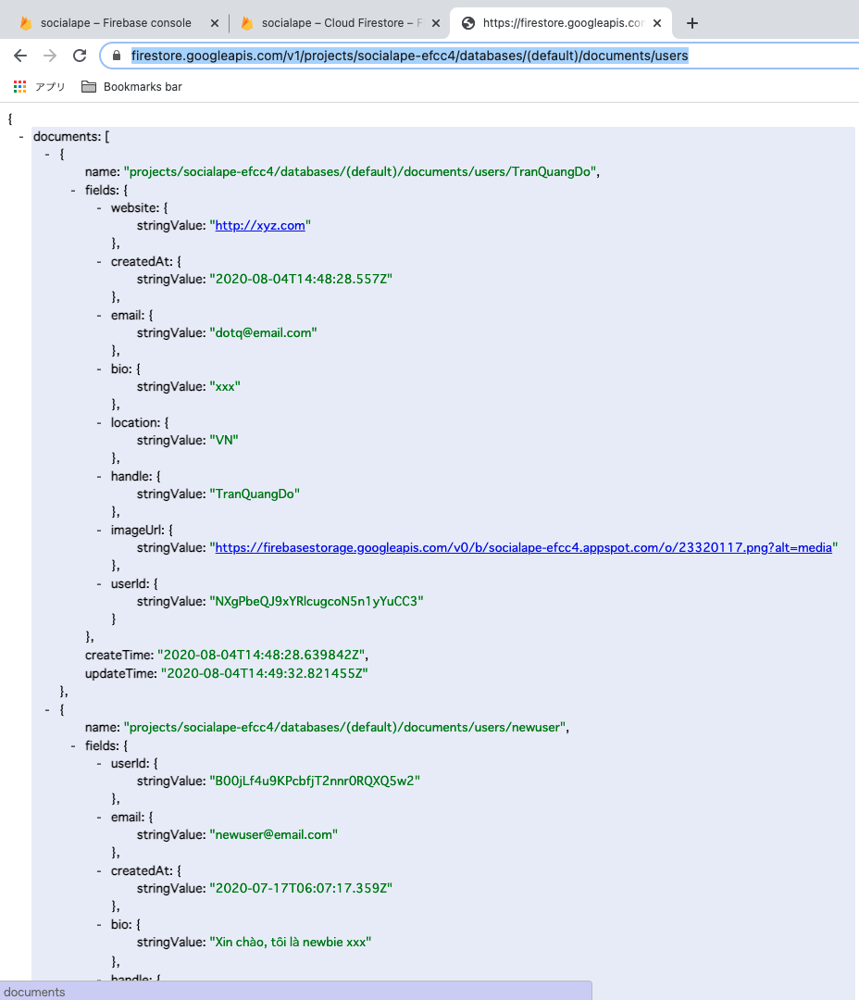
### authentication
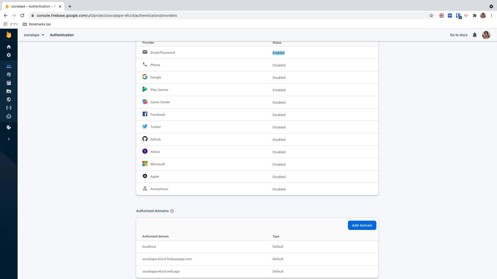
### db
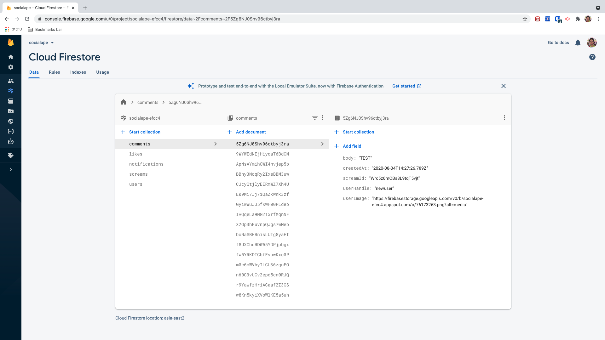
*********
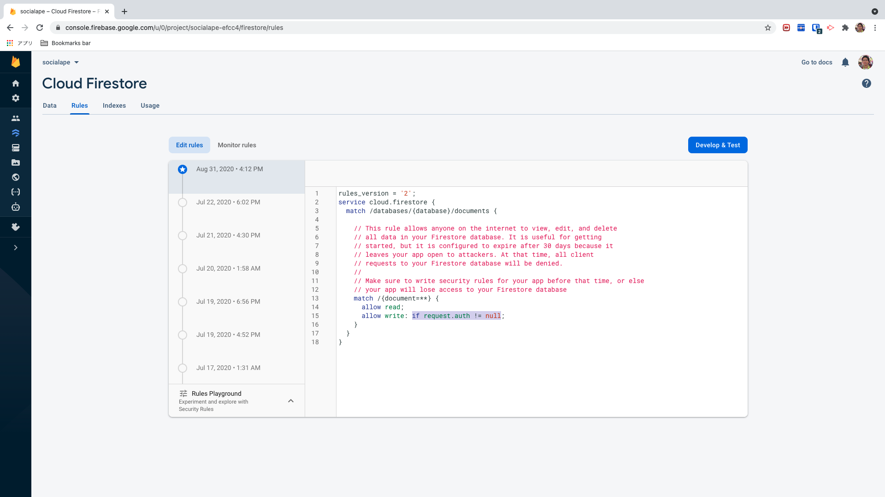
### storage
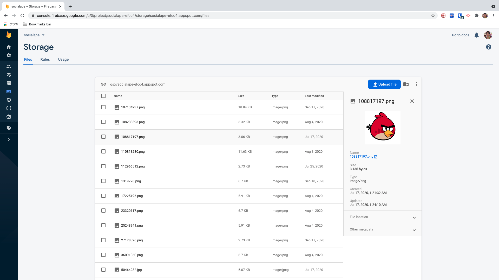
### hosting
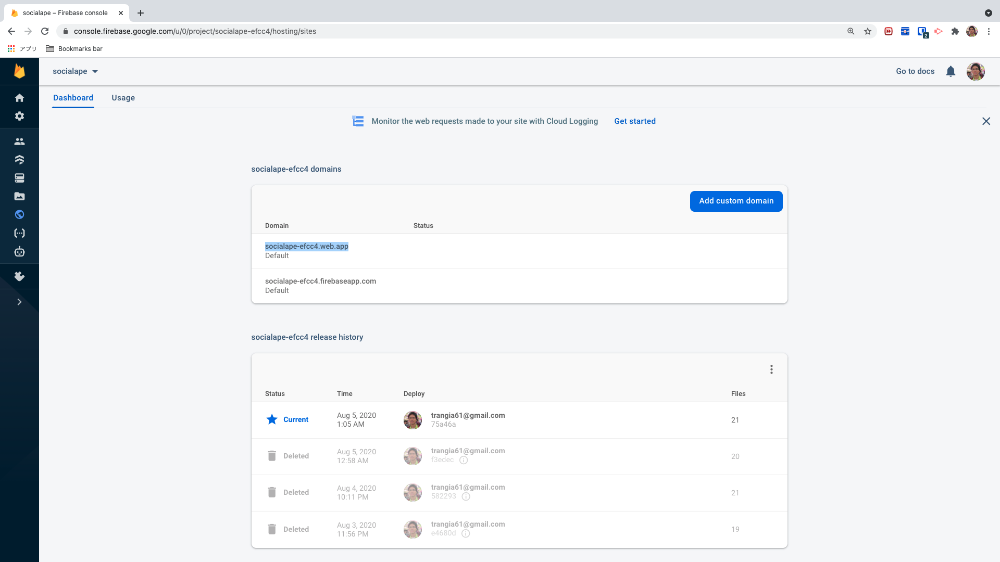
### function
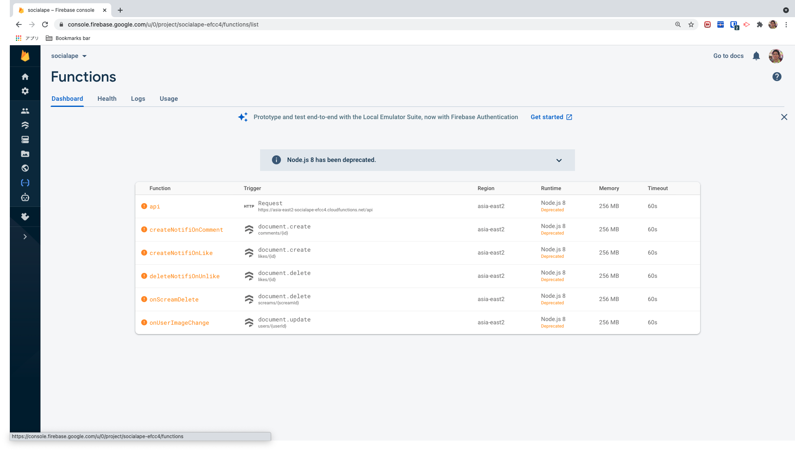
*********
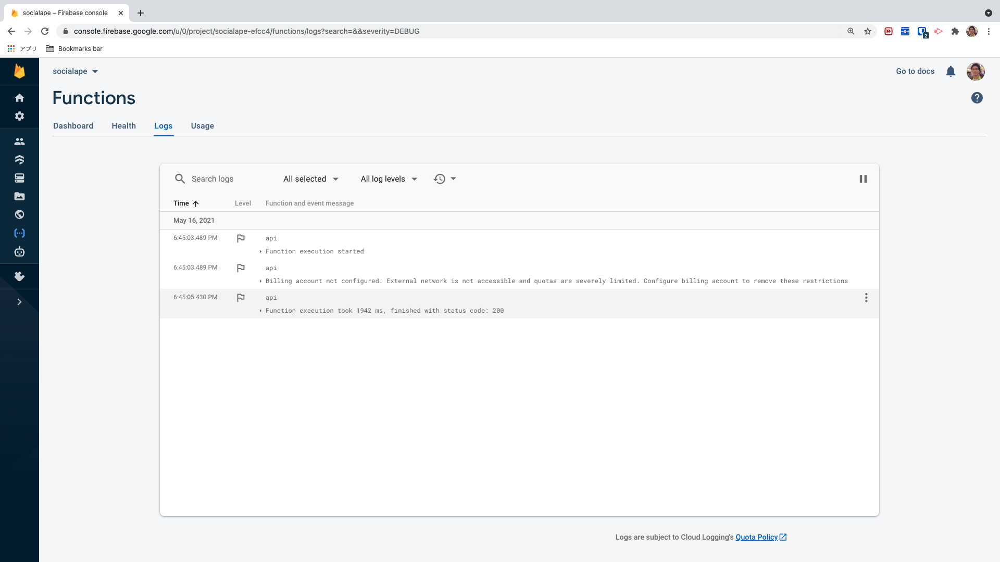
### deploy function
#### a) create
- `<root path>$firebase init firestore`
- -> auto create folder "functions"
#### b) downgrade version if deploy NG
1. npm install
- (NG!) `$npm install -g firebase-tools`
- (OK) `$npm install firebase-tools@6.8.0 - g`
2. package.json
```json
"engines": {
    "node": "10"=>"8"
  },
"firebase-functions": "^3.6.1"=>"^2.3.1"
```
#### c) emulators
- `$firebase emulators:start`
#### d) serve
`functions$firebase serve`
1. create file "functions/serviceAccountKey.json":
- FB's dashboard: tab "project settings" > service accounts > firebase admin sdk > click "generate new private key" > rename file to "serviceAccountKey.json"
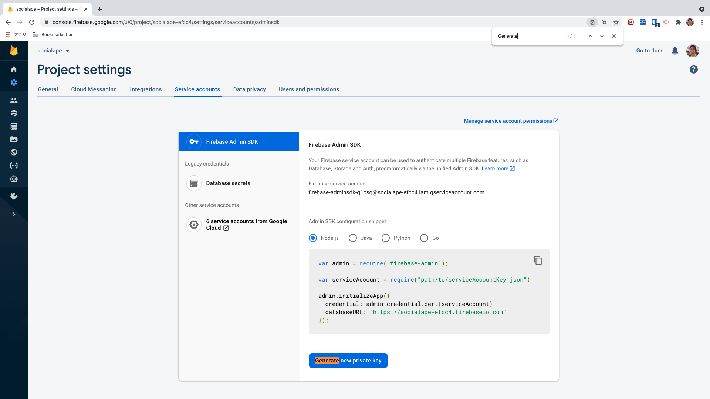
2. file "admin.js"
```js
const serviceAccount = require('../serviceAccountKey.json')
admin.initializeApp({
    credential: admin.credential.cert(serviceAccount),
    // databaseURL:  ****
})
```
#### e) deploy
`functions$firebase deploy`
* Note:
1. NOT run concurrently with serve
2. if get `access right` ERR then: https://console.cloud.google.com/functions > choose project name > check in chkbox function name > add member > allUsers & Cloud Functions Invoker > save
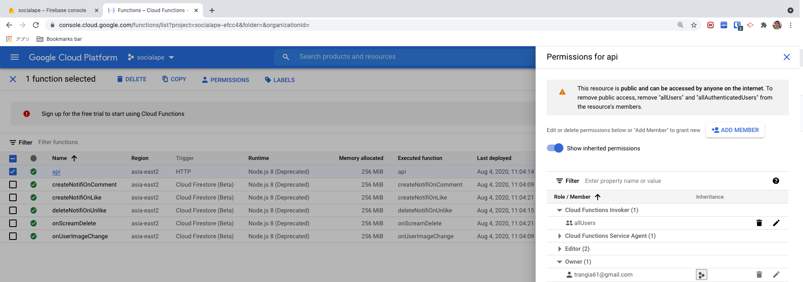
#### f) log
https://console.cloud.google.com/logs/ > choose project name
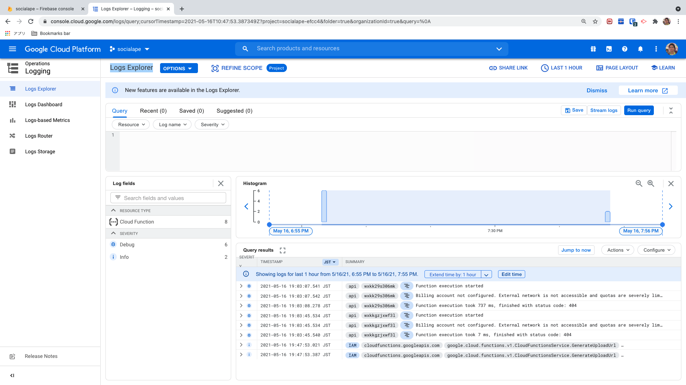
#### ???) function: "login"
1. Option 1:
- `$firebase serve`
- => access "http://localhost:5000/socialape-efcc4/us-central1/api/login"
- => get token for API's header
2. Option 2:
- `$firebase deploy --only functions`
- => access "https://asia-east2-socialape-efcc4.cloudfunctions.net/api/login"
- => get token for API's header
